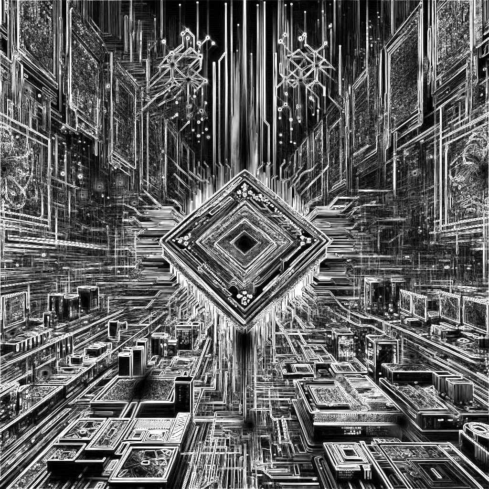

# CSE 4373/5373 Lab 3

Covers convolutional kernels, caching, and constant memory.

# Part 0: Generating the test data

All parts of the lab will use the same data, so running the following command in the `Conv2D` directory will generate it.

```bash
make datagen && ./build/datagen
```

Running this from the `Conv2D` directory will create a `data` directory at the top level of this project. The tests in `run_tests.sh` are already configured to look for it there. Make sure to run each testing script from the sub-directory of the part you are working on.

# Part 1: Basic 2D Convolution

The first part of the lab is to implement a basic 2D convolution kernel that supports the same arguments as the given CPU version.

**Arguments**

- `input`: A `float *` array of input data
- `kernel`: A `float *` array of kernel data
- `output`: A `float *` array of output data
- `height`: The height of the input data
- `width`: The width of the input data
- `kernelSize`: The size of the filter, assumed to always be square
- `outputHeight`: The height of the output data
- `outputWidth`: The width of the output data
- `padding`: The padding to use for the convolution
- `stride`: The stride to use for the convolution
- `dilation`: The dilation to use for the convolution

The provided `conv2d_gpu.cu` already has a main entry point for the 2D convolution and is called in `main_test.cpp`. All you need to do is implement the kernel function, set up the data, and call the kernel function. There are 21 tests provided when creating the data. The variations are set up to test different combinations of padding, stride, and dilation.

## Benchmarking

After ensuring that your kernel passes all the tests, run the provided benchmark script. This will generate output from NVIDIA Visual Profiler that can be used to analyze the performance of your kernel. Since this is the first kernel tested, this will serve as your baseline. The subsequent parts of the lab will involve optimizing this kernel and comparing the performance of each optimization.

# Part 2: Optimizing the Filter Access

The second part of the lab is to load the filter into something other than global memory. This is a simple optimization that can be done by copying the kernel data to constant memory, for example.

## Constant Memory

Since the kernel should support varying filter sizes, you will need to allocate more space for the constant memory array than the size of the filter. The tests will use no greater than a $5 \times 5$ square filter, so only allocate enough space for that size.

## Shared Memory

The filter could also be placed into shared memory. This allows for a dynamically sized filter, but it also requires that the filter be loaded into shared memory for each block. It is worth experimenting with both constant memory and shared memory to see which is more efficient.

**Both kernels should be in the same file `conv2d_gpu.cu`.** When benchmarking them, the profiler will be able to compare the two kernels directly.

## Benchmarking

After ensuring that your kernel passes all the tests, run the provided benchmark script. This will generate output from NVIDIA Visual Profiler that can be used to analyze the performance of your kernels. Compare the performance of these kernels to the baseline kernel from Part 1.

# Part 3: Tiled 2D Convolution

Part 3 of the lab adds tiling to the 2D convolutional kernel. It should be built upon the kernel from part2.

## Benchmarking

After passing the tests, compare the performance of the tiled kernel to the previous kernels using the provided benchmark script.

# Part 4: Caching halo cells

The final modifying of the 2D convolutional kernel is to cache the halo cells. This is done by adding a 2D array to the shared memory that is the same size as the filter. The halo cells are then copied to the shared memory before the main computation is done.

The idea behind his optimization is that it is highly likely that the halo cells are already in L2 cache, so the tile size is the same for both input and output without any additional memory overhead.

## Benchmarking

After passing the tests, compare the performance of the cached kernel to the previous kernels using the provided benchmark script.

# Part 5: Gradient Image

The final part of the lab is to use the optimized 2D convolutional kernel to compute the gradient image of an input image. The gradient image is computed by convolving the input image with the Sobel filter in the x and y directions. The Sobel filter is a $3 \times 3$ filter that is used to compute the gradient of the image. The x-direction filter is:

$$
\begin{bmatrix}
-1 & 0 & 1 \\
-2 & 0 & 2 \\
-1 & 0 & 1
\end{bmatrix}
$$

The y-direction filter is:

$$
\begin{bmatrix}
-1 & -2 & -1 \\
0 & 0 & 0 \\
1 & 2 & 1
\end{bmatrix}
$$

The gradient image is then computed by taking the square root of the sum of the squares of the x and y gradients. This is then normalized to the range $[0, 1]$.

The easiest way to implement this is to copy over a working version of your 2D convolutional kernel and call it on the input image with both Sobel filters. To be clear, you'll need to call the kernel twice, generating an x-gradient and a y-gradient. The gradient image is then computed from these two images by taking the square root of the sum of the squares of the x and y gradients.

An example of the expected output is shown below:

